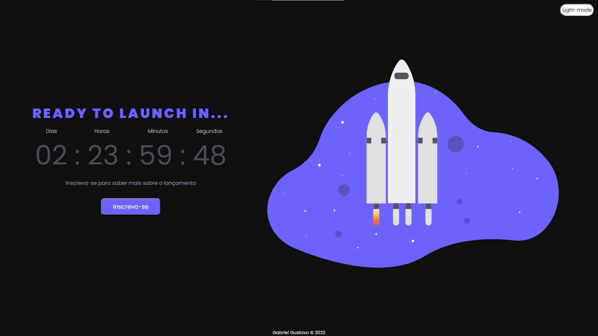

&#xa0;


<h1 align="center">&#x1F680 Coming_soon &#x1F680</h1>


<p align="center">  </p>


## <a href="https://gustabriel.github.io/Coming-soon/"  ><p align="center">Clique aqui para visitar o site<p></a>
</div>

<details close align="center">
  <summary> 
     Preview do site no modo desktop 💻
  </summary>
   <h1 style="margin: auto">
   
   </h1>
</details>

<details close align="center">
  <summary> 
     Preview do site no modo mobile 📱
  </summary>
   <h1 style="margin: auto">
   
   </h1>
</details>

<br>

<p align="center">
  

  


</p>


<p align="center">
  <a href="#dart-about">About</a> &#xa0; | &#xa0; 
  <a href="#sparkles-features">Features</a> &#xa0; | &#xa0;
  <a href="#rocket-technologies">Technologies</a> &#xa0; | &#xa0;
  <a href="#white_check_mark-requirements">Requirements</a> &#xa0; | &#xa0;
  <a href="#checkered_flag-starting">Starting</a> &#xa0; | &#xa0;
  <a href="https://github.com/{{YOUR_GITHUB_USERNAME}}" target="_blank">Author</a>
</p>

<br>

## :dart: About ##

#####  Projeto feito simulando uma página de coming soon para o lançamento de um site na contendo um countdown timer informando quanto tempo falta para o lançamento. 

## :sparkles: Features ##

:heavy_check_mark: Timer de contagem regressiva;
:heavy_check_mark: Botão de inscreva-se;\
:heavy_check_mark: Formulário de inscrição;\


## :rocket: Technologies ##

The following tools were used in this project:

- [JavaScript](https://www.javascript.com/)
- [HTML](https://www.w3schools.com/html/default.asp)
- [CSS](https://www.w3schools.com/css/default.asp)

## :white_check_mark: Requirements ##

Before starting :checkered_flag:, you need to have [Git](https://git-scm.com) and [Node](https://nodejs.org/en/) installed.

## :checkered_flag: Starting ##

```bash
# Clone this project
$ git clone https://github.com/Gustabriel/Coming_soon

# Access
$ cd coming_soon

# Install dependencies
$ yarn

# Run the project
$ yarn start

# The server will initialize in the <http://localhost:3000>
```

## :memo: Dev ##

### Made with :heart: by <a href="https://github.com/Gustabriel" target="_blank"> Gabriel Gustavo</a>
<p align="center">  </p>

&#xa0;

<a href="#top">Back to top</a>
